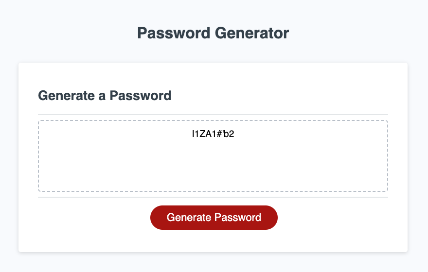

# Password Generator
This is my first JavaScript and second debugging challenge. 

Debugging typically requires more thinking than doing—as the actual writing took far less time to complete than expected.

Writing the meat and potatoes of the JavaScript function felt a lot like examining fractals. Accounting for all the conditions in which a random password could be generated led me to a pattern that eventually made completing the function relatively quickly. 

My biggest "aha" moments were realizing I had to convert the input from a string into a number—then back to a string—and assigning an empty array to the "password" variable at the top of the function to reset the password field.

Implementing a "for" loop and incorporating into the function was also revelatory, as the majority of my final debugging stage involved displaying the password within the box.

As specified in the Challenge Acceptance Criteria, the generator includes the following:

✨ A series of prompts for password criteria.

✨ Criteria presented for selection to include in the password.

✨ Criteria for length to be at least 8 characters and no more than 128 characters.

✨ Criteria for whether or not to include lowercase, uppercase, numeric, and/or special characters.

✨ Validated input for at least one character type to be selected.

✨ Generated password that matches the selected criteria.

✨ Password displayed to the page.

Below is a screenshot of my latest and greatest:

To generate your next secure password, visit https://willbrennana.github.io/password-generator 
